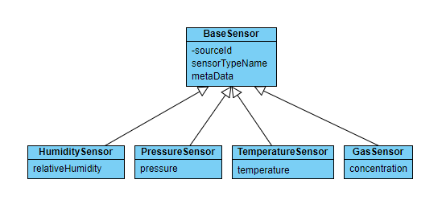

# Sensor Data Model
This model directory contains a Data, Quality of Service (QoS) and Domain System model created with System Designer.

## Data Model
Below are some examples of best practices.

### Sensor Hierarchy
Inhereritance is used since every sensor has a set of common attributes. 

### Nested Annotations
By default the RTI Code Generator generates user-level type-specific methods for all structures/unions found in an IDL file. The BaseSensor has a nested attribute indicating it is not meant to be published or subscribed to individually. Therefore the RTI code generator will not generate code to publish/subscribe to, or to serialize/deserialize. Other definintions like IdentifierType_t, DateTime_t, MetaData_t and IdentifierList_t are also nested.

### Modules
Modules are used to group related elements and to provide namespaces which avoids naming conflicts.

### Typedefs
Typedefs are used with primitive types to make the model more explicit when setting attribute types.

### Constants
- Constants define the lengths of MIN, MED and MAX strings.

- Constants are used to define topic names since these will be generated in source code and can referenced when creating topics programatically. Unfortunately these constants cannot be referenced when defining the Domain topics in XML.

- Constants define QoS libraries and profiles. These will be generated in source code and can be used when setting QoS libraries and profiles programatically. Unfortunately these constants cannot be referenced when setting the Domain entities QoS in XML.

- All variable length types are bounded with the use of constants.  

### Quality of Service (QoS)
It is considered a best practice to not have a default Quality of Service profile. Having one could cause issues if the default profile is changed without the user's knowledge. It is better to have users specify the profile when creating entities.
